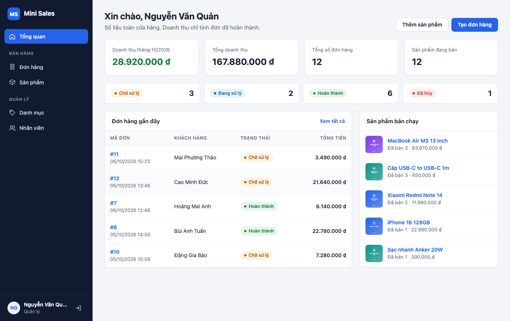

# Tech Store Management

Website quản lý bán hàng cho cửa hàng thiết bị điện tử.

Cửa hàng nhỏ thường ghi sản phẩm và đơn hàng bằng sổ tay hoặc Excel: khó tra cứu, không biết nhân viên nào bán đơn nào, ai cũng sửa được dữ liệu. Tech Store Management gom sản phẩm, danh mục, nhân viên và đơn hàng vào một hệ thống, có phân quyền giữa **Quản lý** và **Nhân viên bán hàng**.



## Chức năng

| Nhóm | Chức năng |
|---|---|
| Sản phẩm | Xem danh sách, thêm, xem chi tiết, sửa, xóa. Tìm theo tên, lọc theo danh mục và trạng thái. Thông tin gồm tên, danh mục, giá, mô tả, hình ảnh, trạng thái (Đang bán / Ngừng bán) |
| Danh mục | Danh sách, thêm, sửa, xóa. Không cho xóa danh mục còn sản phẩm |
| Nhân viên | Tài khoản (username, password, role, status) và thông tin nhân viên (họ tên, email, SĐT, địa chỉ, avatar), quan hệ 1-1. Tài khoản bị khóa không đăng nhập được |
| Đơn hàng | Danh sách, tạo đơn nhiều sản phẩm, xem chi tiết, cập nhật trạng thái (Pending → Processing → Completed, hoặc Cancelled), xóa |
| Đăng nhập, phân quyền | Quản lý xem và quản lý tất cả. Nhân viên bán hàng xem sản phẩm, tạo đơn và chỉ quản lý đơn do mình tạo |

## Tài liệu nộp kèm

| Deliverable | Ở đâu |
|---|---|
| Source code | Thư mục này (đưa lên Git theo mục [Đưa lên GitHub](#đưa-lên-github)) |
| Database + Migration | `database/migrations/`, file export `database/mini_sales.sql` |
| ERD | [docs/01-erd.md](docs/01-erd.md), hình `docs/images/erd.png` |
| System Flow | [docs/02-system-flow.md](docs/02-system-flow.md) |
| Debug Report | [docs/03-debug-report.md](docs/03-debug-report.md) |
| Quy trình Deploy | [docs/04-deploy.md](docs/04-deploy.md) |
| Kịch bản thuyết trình | [docs/05-presentation.md](docs/05-presentation.md) |
| URL demo | Chưa deploy |

## Công nghệ

| Yêu cầu | Trong project |
|---|---|
| HTML | Blade template trong `resources/views/` |
| CSS, Flexbox, Responsive | Tự viết trong `public/css/app.css`, không dùng framework. Bố cục bằng Flexbox. Dưới 900px sidebar thu thành menu, dưới 640px bảng chuyển thành dạng thẻ |
| JavaScript | JavaScript thuần trong `public/js/app.js`: menu mobile, xem trước ảnh, hỏi lại trước khi xóa, form đơn hàng tự tính tiền |
| PHP / Laravel | Laravel 13, PHP 8.3 trở lên |
| MySQL | Database `mini_sales` |
| Laravel MVC, Route, Controller, Model, CRUD | `routes/web.php`, `app/Http/Controllers/`, `app/Models/` |

## Cài đặt

### Phần mềm cần có

| Phần mềm | Cài trên macOS |
|---|---|
| PHP 8.3 trở lên | `brew install php` |
| Composer | `brew install composer` |
| MySQL | `brew install mysql` rồi `brew services start mysql` |

Không cần Node/npm.

### Lần đầu (sau khi clone)

```bash
cd tech-store-management
composer install
cp .env.example .env
php artisan key:generate

# Tạo database (user root, không mật khẩu; nếu khác thì sửa DB_USERNAME/DB_PASSWORD trong .env)
mysql -u root -e "CREATE DATABASE mini_sales CHARACTER SET utf8mb4 COLLATE utf8mb4_unicode_ci;"

php artisan migrate --seed   # tạo bảng và nạp dữ liệu mẫu
php artisan storage:link     # cho phép hiển thị ảnh sản phẩm, avatar đã upload
```

File `database/mini_sales.sql` là bản export database để nộp và xem cấu trúc. Khi cài đặt nên dùng `migrate --seed` như trên: ảnh minh họa sản phẩm mẫu do seeder tạo ra trong `storage/` và không được đưa lên Git, nên nếu chỉ import file SQL thì sản phẩm mẫu sẽ không có ảnh.

### Chạy

```bash
php artisan serve
```

Mở http://127.0.0.1:8000

Muốn làm mới toàn bộ dữ liệu demo: `php artisan migrate:fresh --seed`.

### Tài khoản demo

Mật khẩu đều là `password`.

| Username | Vai trò | Ghi chú |
|---|---|---|
| `manager` | Quản lý | Toàn quyền |
| `staff` | Nhân viên bán hàng | Có 6 đơn hàng mẫu |
| `hang.le` | Nhân viên bán hàng | Có 4 đơn hàng mẫu |
| `tuan.pham` | Nhân viên bán hàng | Đã khóa, không đăng nhập được. Có đơn cũ nên không xóa được, chỉ khóa |

## Phân quyền

| Chức năng | Quản lý | Nhân viên bán hàng |
|---|---|---|
| Xem sản phẩm | ✔ | ✔ |
| Thêm, sửa, xóa sản phẩm | ✔ | ✘ |
| Quản lý danh mục, nhân viên | ✔ | ✘ |
| Xem đơn hàng | Tất cả | Chỉ đơn mình tạo |
| Tạo đơn, cập nhật trạng thái | ✔ | Đơn của mình |
| Xóa đơn hàng | Mọi đơn | Đơn của mình, khi còn Chờ xử lý |

Kiểm tra ở server bằng middleware `can:manager`, scope `Order::visibleTo()` và `OrderPolicy`. Chi tiết trong [docs/02-system-flow.md](docs/02-system-flow.md#5-phân-quyền-quản-lý-và-nhân-viên-bán-hàng).

## Cấu trúc thư mục

```
app/
├── Enums/                 OrderStatus, ProductStatus, EmployeeRole, EmployeeStatus
├── Http/
│   ├── Controllers/       Auth/LoginController, Dashboard, Category, Product, Order, Employee
│   ├── Middleware/        EnsureEmployeeIsActive (đăng xuất tài khoản bị khóa)
│   └── Requests/          validation: ProductRequest, StoreOrderRequest, EmployeeRequest, CategoryRequest
├── Models/                Employee, EmployeeProfile, Category, Product, Order, OrderItem
├── Policies/              OrderPolicy (quyền trên từng đơn hàng)
└── Providers/             AppServiceProvider (Gate "manager", @money)
database/
├── migrations/            mỗi bảng một file
├── seeders/               dữ liệu mẫu tiếng Việt, tự tạo ảnh minh họa sản phẩm
└── mini_sales.sql         export database MySQL
public/
├── css/app.css            CSS tự viết (Flexbox, responsive)
└── js/app.js              JavaScript thuần
resources/views/           Blade view
routes/web.php             toàn bộ route
lang/vi/                   câu báo lỗi tiếng Việt
tests/Feature/             70 test tự động
docs/                      ERD, System Flow, Debug Report, Deploy, kịch bản thuyết trình
```

## Chạy test

```bash
php artisan test                                                     # SQLite trong bộ nhớ, nhanh
DB_CONNECTION=mysql DB_DATABASE=mini_sales_test php artisan test     # trên MySQL thật
```

Chạy trên MySQL cần tạo trước database `mini_sales_test`. Cả hai cách đều không đụng tới dữ liệu trong `mini_sales`.

## Đối chiếu bộ câu hỏi ôn tập với code

| Câu | Nội dung | Xem ở đâu |
|---|---|---|
| 1, 3, 4 | Flow request, MVC | `routes/web.php` → `ProductController@index` → `Product` → `resources/views/products/index.blade.php`. Sơ đồ ở [docs/02-system-flow.md](docs/02-system-flow.md) |
| 2 | Laravel cung cấp gì | Routing, Eloquent, Validation (Form Request), Middleware, Migration, Policy, Storage |
| 5, 6 | Flow thêm Product, route POST | `Route::resource('products', ...)` sinh `POST /products` → `ProductController@store`. Xem bằng `php artisan route:list --path=products` |
| 7 | Trách nhiệm Controller | `ProductController`: nhận request đã validate, lưu ảnh, gọi Model, trả redirect |
| 8, 23, 25 | Model, hasMany, belongsTo | `Category::products()` hasMany, `Product::category()` belongsTo |
| 9 | Relationship của Employee | `Employee::profile()` hasOne, `Employee::orders()` hasMany |
| 10 | Relationship của Order | `Order::employee()`, `Order::items()`, `Order::products()` belongsToMany |
| 11, 12, 27 | PK, FK, các quan hệ | [docs/01-erd.md](docs/01-erd.md) |
| 13 | Vì sao cần `order_items` | Migration `create_order_items_table`, `OrderController@store`. Test `test_order_item_keeps_price_at_time_of_order` |
| 14 | Migration | `database/migrations/` |
| 19, 20 | Validation, `price = abc` | `app/Http/Requests/ProductRequest.php`. Test `test_price_must_be_numeric` |
| 21 | Vì sao backend vẫn validate | Form có `required`, `type="number"`, `min="0"`, nhưng test gửi thẳng request vẫn bị backend chặn |
| 22 | Xóa Product đã có trong đơn | `ProductController@destroy` + FK RESTRICT. Test `test_product_used_in_order_items_cannot_be_deleted` |
| 24 | Xóa Category còn Product | `CategoryController@destroy`. Test `test_category_with_products_cannot_be_deleted` |
| 26 | Flow đăng nhập | `Auth/LoginController@store`: validate → tìm Employee → `Hash::check` → kiểm tra status → `Auth::login` → tạo lại session |
| 15–18, 28–33 | Git | Mục dưới |

## Đưa lên GitHub

```bash
git init
git add .
git commit -m "Initial commit: Tech Store Management"
git branch -M main
git remote add origin https://github.com/<tai-khoan>/tech-store-management.git
git push -u origin main
```

Khi làm chức năng mới, tạo branch riêng thay vì code thẳng trên `main`:

```bash
git switch -c feature/export-orders
# ... sửa code ...
git status
git add .
git commit -m "Add order export"
git push -u origin feature/export-orders
# Tạo Pull Request trên GitHub, review xong mới merge vào main
```

`.gitignore` đã loại `vendor/`, `.env` và file ảnh upload, nên không đẩy mật khẩu hay thư viện lên Git.

## Lỗi thường gặp

| Hiện tượng | Cách xử lý |
|---|---|
| `SQLSTATE[HY000] [2002] Connection refused` | MySQL chưa chạy: `brew services start mysql` |
| `Unknown database 'mini_sales'` | Chưa tạo database, xem mục Lần đầu |
| Ảnh sản phẩm không hiện | Chưa chạy `php artisan storage:link` |
| Trang báo 419 Page Expired | Phiên làm việc hết hạn, tải lại trang rồi gửi lại form |
| Đăng nhập báo "Tài khoản đã bị khóa" | Tài khoản có status Đã khóa, Quản lý mở khóa trong trang Nhân viên |
