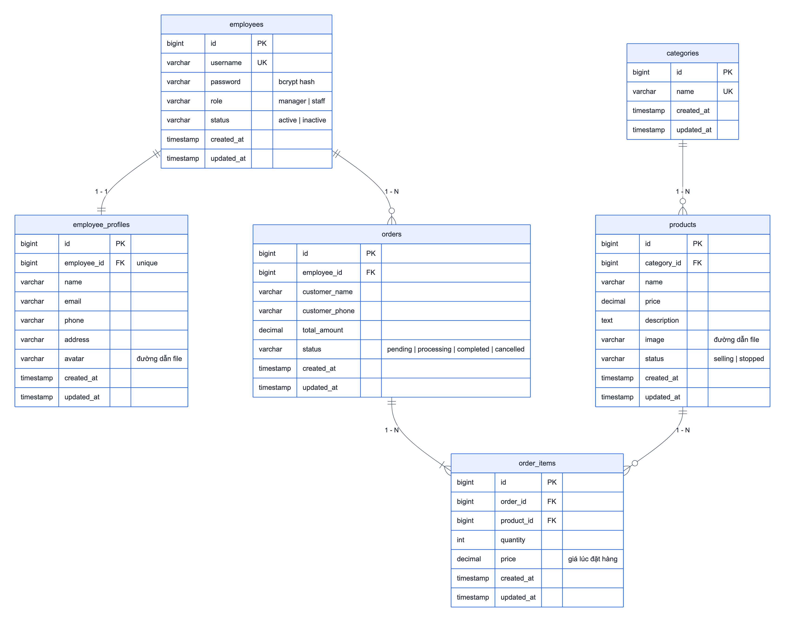
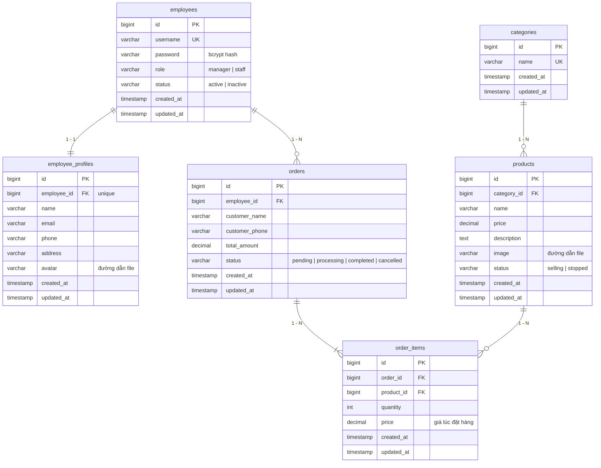

# ERD – Thiết kế database

Database gồm 6 bảng nghiệp vụ, đúng như đề bài yêu cầu. Cấu trúc được tạo bằng migration trong `database/migrations/`, mỗi bảng một file.



<!-- diagram: erd -->


## Các bảng

| Bảng | Vai trò | Migration |
|---|---|---|
| `employees` | Tài khoản đăng nhập: username, password đã hash, vai trò, trạng thái | `2026_10_06_000001_create_employees_table.php` |
| `employee_profiles` | Thông tin nhân viên: họ tên, email, SĐT, địa chỉ, avatar | `2026_10_06_000002_create_employee_profiles_table.php` |
| `categories` | Danh mục sản phẩm | `2026_10_06_000003_create_categories_table.php` |
| `products` | Sản phẩm: tên, giá, mô tả, ảnh, trạng thái | `2026_10_06_000004_create_products_table.php` |
| `orders` | Đơn hàng: khách hàng, nhân viên tạo đơn, tổng tiền, trạng thái | `2026_10_06_000005_create_orders_table.php` |
| `order_items` | Từng dòng sản phẩm trong đơn: số lượng, giá lúc bán | `2026_10_06_000006_create_order_items_table.php` |

Ngoài ra Laravel có sẵn các bảng hệ thống: `migrations`, `sessions`, `cache`, `jobs`, `password_reset_tokens`.

## Quan hệ

| Quan hệ | Khóa ngoại | Khai báo trong Model |
|---|---|---|
| Employee 1 – 1 EmployeeProfile | `employee_profiles.employee_id` (unique) | `Employee::profile()` hasOne · `EmployeeProfile::employee()` belongsTo |
| Category 1 – N Product | `products.category_id` | `Category::products()` hasMany · `Product::category()` belongsTo |
| Employee 1 – N Order | `orders.employee_id` | `Employee::orders()` hasMany · `Order::employee()` belongsTo |
| Order 1 – N OrderItem | `order_items.order_id` | `Order::items()` hasMany · `OrderItem::order()` belongsTo |
| Product 1 – N OrderItem | `order_items.product_id` | `Product::orderItems()` hasMany · `OrderItem::product()` belongsTo |
| Order N – N Product | thông qua `order_items` | `Order::products()` · `Product::orders()` belongsToMany |

**Vì sao 1-1 giữa employees và employee_profiles?** Cột `employee_id` trong `employee_profiles` có ràng buộc `unique`, nên mỗi tài khoản chỉ có tối đa một profile. Tách bảng giúp phần đăng nhập (username, password) tách khỏi thông tin cá nhân.

**Vì sao Order và Product cần bảng `order_items`?** Một đơn có nhiều sản phẩm và một sản phẩm nằm trong nhiều đơn, tức là quan hệ N-N. Bảng trung gian `order_items` còn lưu thêm `quantity` và `price` tại thời điểm bán. Nhờ đó, khi giá sản phẩm thay đổi về sau, đơn cũ vẫn giữ đúng giá đã bán.

## Xử lý khi xóa dữ liệu

| Khóa ngoại | Khi xóa bản ghi cha | Lý do |
|---|---|---|
| `employee_profiles.employee_id` | CASCADE, xóa luôn profile | Profile không còn ý nghĩa khi tài khoản bị xóa |
| `products.category_id` | RESTRICT, database từ chối | Không để sản phẩm mất danh mục |
| `orders.employee_id` | RESTRICT | Giữ lịch sử ai đã bán đơn nào |
| `order_items.order_id` | CASCADE, xóa luôn dòng hàng | Dòng hàng thuộc về đơn |
| `order_items.product_id` | RESTRICT | Giữ lịch sử đơn hàng |

Controller kiểm tra trước và báo lỗi dễ hiểu cho người dùng (ví dụ "Không thể xóa danh mục vì đang có 4 sản phẩm"). Ràng buộc ở database là lớp bảo vệ thứ hai, phòng khi có code khác xóa trực tiếp.

## Lệnh liên quan

```bash
php artisan migrate              # chạy các migration chưa chạy
php artisan migrate:rollback     # quay lại lần migrate gần nhất
php artisan migrate:fresh --seed # xóa hết bảng, tạo lại và nạp dữ liệu mẫu
```

File `database/mini_sales.sql` là bản export database MySQL (cấu trúc + dữ liệu mẫu), tạo bằng `mysqldump`. Import bằng `mysql -u root mini_sales < database/mini_sales.sql`.
