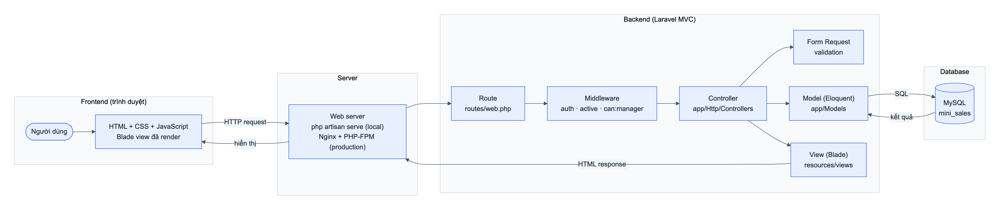
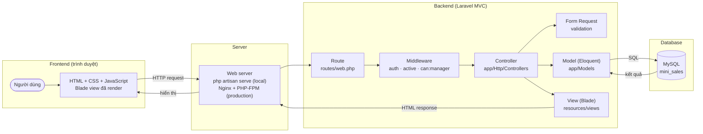
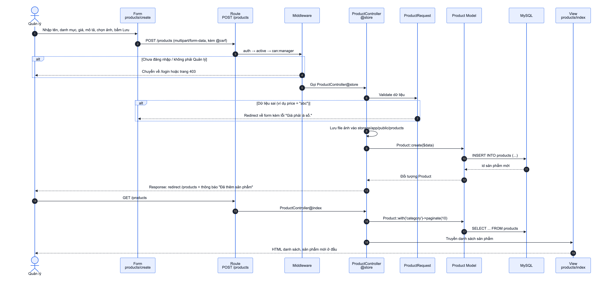
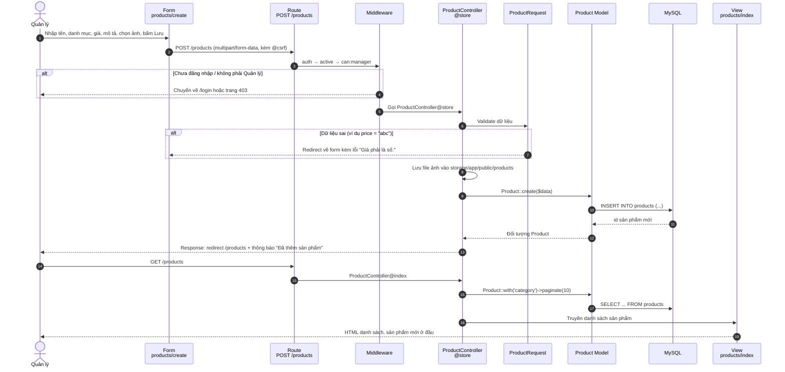
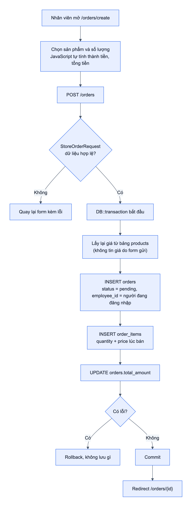
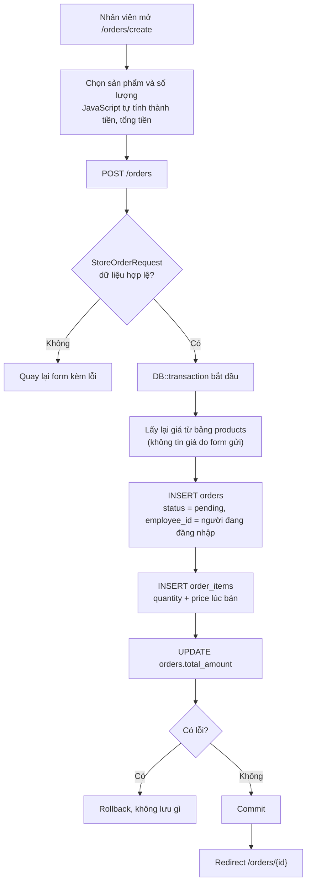
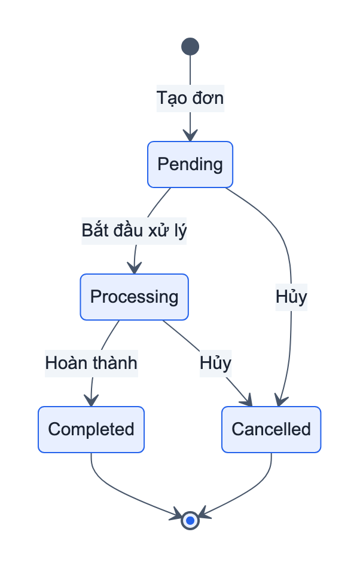
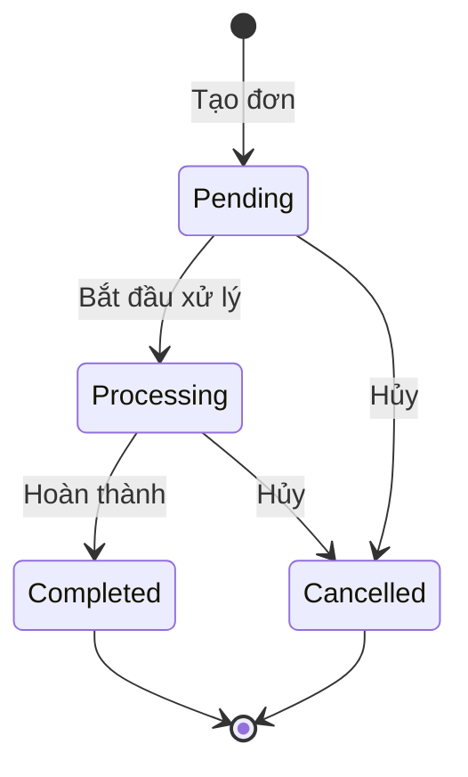
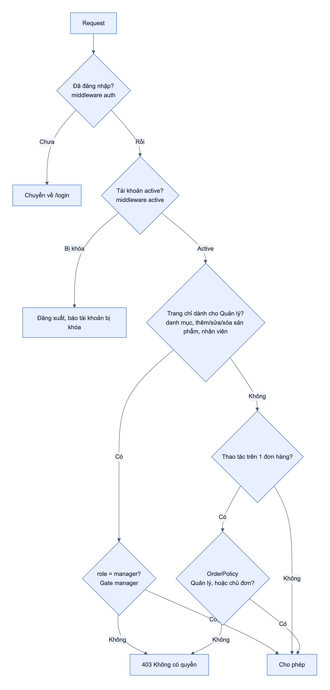
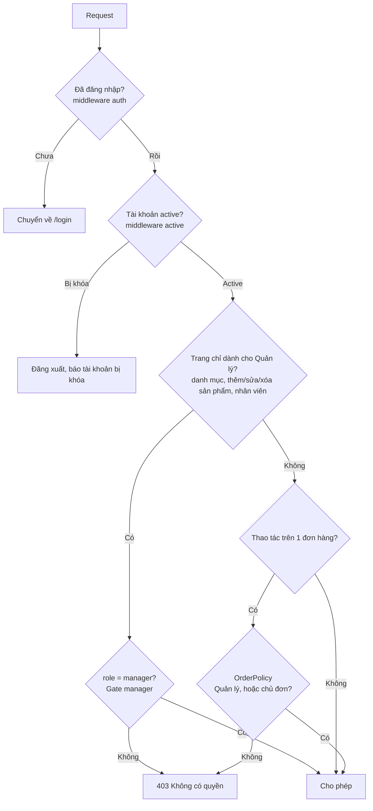

# System Flow

## 1. Tổng quan: Frontend → Backend → Database → Server

<!-- diagram: system-overview -->

| Lớp | Thành phần | Trong project |
|---|---|---|
| Frontend | HTML, CSS (Flexbox, responsive), JavaScript thuần | `resources/views/*.blade.php`, `public/css/app.css`, `public/js/app.js` |
| Server | Nhận request HTTP, chuyển cho PHP chạy Laravel | Local: `php artisan serve`. Production: Nginx + PHP-FPM (xem [04-deploy.md](04-deploy.md)) |
| Backend | Laravel theo mô hình MVC | `routes/web.php`, `app/Http`, `app/Models`, `app/Policies` |
| Database | MySQL, cấu trúc tạo bằng migration | `database/migrations`, kết nối cấu hình trong `.env` |

## 2. Flow thêm sản phẩm

User → Form → Route → Controller → Model → Database → Response → View

<!-- diagram: flow-add-product -->

### Vai trò từng thành phần

| Thành phần | Làm gì | File |
|---|---|---|
| **User** | Quản lý mở trang thêm sản phẩm và điền form | |
| **Form** | Thu thập dữ liệu. Có validation phía trình duyệt (`required`, `type="number"`, `min="0"`, `accept="image/*"`) để báo lỗi sớm. JavaScript hiện ảnh xem trước. | `resources/views/products/_form.blade.php` |
| **Route** | Ánh xạ `POST /products` tới `ProductController@store`. Gắn middleware kiểm tra đăng nhập và quyền. | `routes/web.php` |
| **Middleware** | `auth`: phải đăng nhập. `active`: tài khoản chưa bị khóa. `can:manager`: chỉ Quản lý được thêm sản phẩm. | `bootstrap/app.php`, `app/Http/Middleware/EnsureEmployeeIsActive.php` |
| **Controller** | Điều phối: nhận request đã validate, lưu ảnh, gọi Model, trả response | `app/Http/Controllers/ProductController.php` |
| **Form Request** | Validation phía server, không tin dữ liệu từ trình duyệt: tên bắt buộc, danh mục phải tồn tại, giá là số ≥ 0, ảnh đúng định dạng và ≤ 2 MB | `app/Http/Requests/ProductRequest.php` |
| **Model** | Đại diện bảng `products`. Eloquent sinh câu SQL. Khai báo quan hệ `belongsTo(Category)`. | `app/Models/Product.php` |
| **Database** | Lưu dữ liệu. Khóa ngoại `category_id` bảo đảm danh mục tồn tại. | MySQL, bảng `products` |
| **Response** | Redirect về danh sách kèm flash message (Post/Redirect/Get, tránh gửi trùng form khi F5) | |
| **View** | Blade render HTML từ dữ liệu Controller truyền sang | `resources/views/products/index.blade.php` |

## 3. Flow tạo đơn hàng

<!-- diagram: flow-create-order -->

Transaction bảo đảm đơn hàng và các dòng hàng được lưu cùng nhau. Nếu một bước lỗi thì không có đơn "nửa vời" nào trong database.

## 4. Flow trạng thái đơn hàng

<!-- diagram: order-status -->

| Trạng thái | Hiển thị | Chuyển được sang |
|---|---|---|
| `pending` | Chờ xử lý | Đang xử lý, Đã hủy |
| `processing` | Đang xử lý | Hoàn thành, Đã hủy |
| `completed` | Hoàn thành | Không đổi được nữa |
| `cancelled` | Đã hủy | Không đổi được nữa |

Quy tắc chuyển trạng thái nằm ở `app/Enums/OrderStatus.php`. Doanh thu chỉ tính các đơn Hoàn thành.

## 5. Phân quyền: Quản lý và Nhân viên bán hàng

<!-- diagram: authorization -->

| Chức năng | Quản lý | Nhân viên bán hàng |
|---|---|---|
| Xem danh sách, chi tiết sản phẩm | ✔ | ✔ |
| Thêm, sửa, xóa sản phẩm | ✔ | ✘ |
| Quản lý danh mục | ✔ | ✘ |
| Quản lý nhân viên | ✔ | ✘ |
| Xem đơn hàng | Tất cả đơn | Chỉ đơn mình tạo |
| Tạo đơn hàng | ✔ | ✔ |
| Cập nhật trạng thái đơn | Mọi đơn | Đơn của mình |
| Xóa đơn hàng | Mọi đơn | Đơn của mình, khi còn Chờ xử lý |

Phân quyền được kiểm tra ở 3 chỗ:

1. **Route middleware** `can:manager` chặn cả nhóm trang quản lý (`routes/web.php`).
2. **Query scope** `Order::visibleTo($employee)` lọc danh sách: nhân viên chỉ nhận được đơn của mình (`app/Models/Order.php`).
3. **Policy** `OrderPolicy` kiểm tra từng đơn khi xem, đổi trạng thái, xóa (`app/Policies/OrderPolicy.php`). Nhân viên gõ thẳng URL đơn của người khác vẫn nhận 403.

Ẩn nút trên giao diện chỉ để dễ dùng. Bảo mật thật nằm ở 3 lớp trên phía server.
