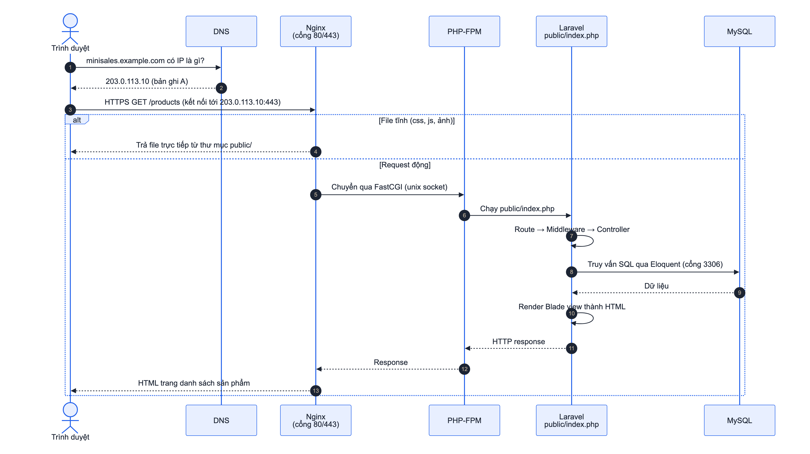
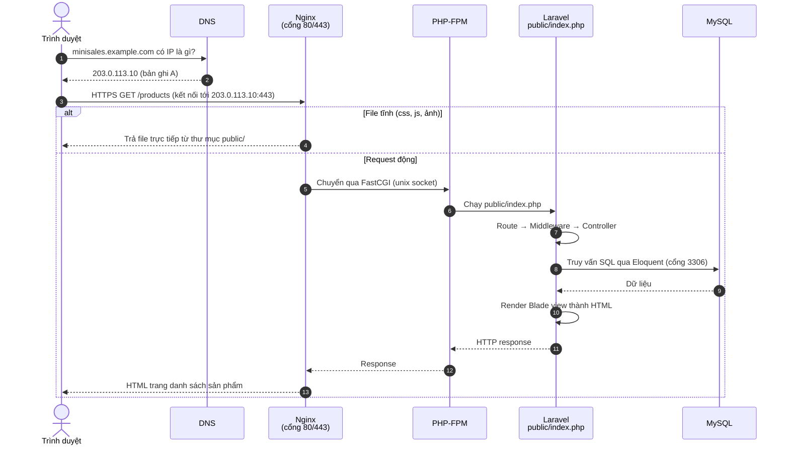

# Quy trình Deploy Laravel lên server

Project chưa deploy thật. Tài liệu này mô tả request đi qua những thành phần nào và các bước cần làm để đưa website Laravel lên một máy chủ Linux (VPS Ubuntu).

## 1. Flow của một request

Domain → DNS → Nginx → PHP-FPM → Laravel → MySQL



<!-- diagram: deploy-flow -->


### Khi người dùng nhập domain trên trình duyệt

| Bước | Thành phần | Chuyện gì xảy ra |
|---|---|---|
| 1 | **Domain** | Người dùng gõ `https://minisales.example.com/products`. Domain là tên dễ nhớ, mua từ nhà đăng ký tên miền. |
| 2 | **DNS** | Trình duyệt hỏi DNS: "domain này ở địa chỉ IP nào?". Bản ghi **A** trỏ domain về IP public của server, ví dụ `203.0.113.10`. Kết quả được cache theo TTL. |
| 3 | **Kết nối tới server** | Trình duyệt mở kết nối TCP tới IP đó, cổng 443 (HTTPS), bắt tay TLS bằng chứng chỉ SSL để mã hóa dữ liệu. |
| 4 | **Nginx** | Web server nhận request. Nếu là file tĩnh có sẵn trong `public/` (CSS, JS, ảnh) thì trả luôn, rất nhanh. Nếu không, chuyển request cho PHP-FPM. Nginx không tự chạy được PHP. |
| 5 | **PHP-FPM** | Trình quản lý tiến trình PHP. Nhận request qua giao thức FastCGI, giao cho một worker PHP chạy file `public/index.php`. |
| 6 | **Laravel** | `index.php` khởi động framework. Router tìm route khớp `/products`, chạy middleware (đăng nhập, quyền), gọi `ProductController@index`. |
| 7 | **MySQL** | Model Eloquent sinh câu SQL, gửi tới MySQL và nhận dữ liệu về. |
| 8 | **Response** | Controller đưa dữ liệu cho Blade view, view render ra HTML. Response đi ngược lại PHP-FPM, Nginx rồi về trình duyệt. |
| 9 | **Trình duyệt** | Hiển thị HTML, tải tiếp CSS/JS/ảnh (bước 4, Nginx trả trực tiếp). |

## 2. Các bước deploy lên VPS Ubuntu

### Bước 1: Chuẩn bị server

```bash
sudo apt update && sudo apt upgrade -y
sudo apt install -y nginx mysql-server git unzip \
    php8.3-fpm php8.3-cli php8.3-mysql php8.3-mbstring php8.3-xml \
    php8.3-curl php8.3-zip php8.3-gd php8.3-intl php8.3-bcmath
# Cài Composer
curl -sS https://getcomposer.org/installer | php
sudo mv composer.phar /usr/local/bin/composer
```

### Bước 2: Tạo database và user riêng cho ứng dụng

```sql
CREATE DATABASE mini_sales CHARACTER SET utf8mb4 COLLATE utf8mb4_unicode_ci;
CREATE USER 'mini_sales'@'localhost' IDENTIFIED BY 'mat-khau-manh';
GRANT ALL PRIVILEGES ON mini_sales.* TO 'mini_sales'@'localhost';
FLUSH PRIVILEGES;
```

Không dùng tài khoản `root` cho ứng dụng.

### Bước 3: Lấy source code từ Git

```bash
cd /var/www
sudo git clone https://github.com/<tai-khoan>/mini-sales-management.git
cd mini-sales-management
composer install --no-dev --optimize-autoloader
```

### Bước 4: Cấu hình môi trường

```bash
cp .env.example .env
php artisan key:generate
```

Sửa `.env` cho môi trường production:

```env
APP_ENV=production
APP_DEBUG=false            # bắt buộc false, tránh lộ thông tin lỗi ra ngoài
APP_URL=https://minisales.example.com

DB_CONNECTION=mysql
DB_HOST=127.0.0.1
DB_PORT=3306
DB_DATABASE=mini_sales
DB_USERNAME=mini_sales
DB_PASSWORD=mat-khau-manh
```

### Bước 5: Database, storage, phân quyền thư mục

```bash
php artisan migrate --force          # --force vì đang ở production
php artisan storage:link             # để ảnh upload truy cập được qua /storage
sudo chown -R www-data:www-data storage bootstrap/cache
sudo chmod -R 775 storage bootstrap/cache
```

`www-data` là user mà Nginx và PHP-FPM chạy dưới quyền. Laravel cần ghi được vào `storage/` (log, session, ảnh upload) và `bootstrap/cache/`.

### Bước 6: Tối ưu cho production

```bash
php artisan config:cache
php artisan route:cache
php artisan view:cache
```

### Bước 7: Cấu hình Nginx

File `/etc/nginx/sites-available/mini-sales`:

```nginx
server {
    listen 80;
    server_name minisales.example.com;
    root /var/www/mini-sales-management/public;   # chỉ public/ được lộ ra ngoài

    index index.php;
    charset utf-8;
    client_max_body_size 5M;                       # cho phép upload ảnh 2 MB

    location / {
        try_files $uri $uri/ /index.php?$query_string;
    }

    location ~ \.php$ {
        fastcgi_pass unix:/run/php/php8.3-fpm.sock;   # chuyển cho PHP-FPM
        fastcgi_param SCRIPT_FILENAME $realpath_root$fastcgi_script_name;
        include fastcgi_params;
    }

    location ~ /\.(?!well-known).* {
        deny all;                                   # chặn truy cập .env, .git
    }
}
```

```bash
sudo ln -s /etc/nginx/sites-available/mini-sales /etc/nginx/sites-enabled/
sudo nginx -t                 # kiểm tra cấu hình
sudo systemctl reload nginx
```

- `root` trỏ vào `public/`, nên file `.env` và source code nằm ngoài, không truy cập được từ web.
- `try_files`: có file thật thì trả file, không có thì chuyển cho `index.php` để Laravel xử lý route.

### Bước 8: Trỏ domain và cài HTTPS

1. Vào trang quản lý DNS của nhà cung cấp domain, tạo bản ghi **A**: `minisales.example.com` trỏ tới IP public của VPS.
2. Chờ DNS cập nhật (vài phút tới vài giờ), kiểm tra bằng `nslookup minisales.example.com`.
3. Cài chứng chỉ SSL miễn phí:

```bash
sudo apt install -y certbot python3-certbot-nginx
sudo certbot --nginx -d minisales.example.com
```

4. Mở firewall: `sudo ufw allow 'Nginx Full'`. Chỉ mở cổng 22 (SSH), 80 và 443. Không mở cổng MySQL 3306 ra ngoài.

### Bước 9: Cập nhật phiên bản mới

```bash
cd /var/www/mini-sales-management
php artisan down                       # bật chế độ bảo trì
git pull origin main
composer install --no-dev --optimize-autoloader
php artisan migrate --force
php artisan config:cache && php artisan route:cache && php artisan view:cache
php artisan up
```

## 3. Khi deploy xong mà không chạy

| Hiện tượng | Thường do | Kiểm tra |
|---|---|---|
| Không vào được domain | DNS chưa trỏ đúng IP, hoặc firewall chặn | `nslookup <domain>`, `sudo ufw status` |
| 502 Bad Gateway | PHP-FPM chưa chạy, hoặc sai đường dẫn socket | `systemctl status php8.3-fpm`, `/var/log/nginx/error.log` |
| 500 Server Error | Lỗi Laravel: thiếu `APP_KEY`, sai thông tin DB, thiếu quyền ghi | `storage/logs/laravel.log` |
| Ảnh upload không hiện (404) | Chưa chạy `php artisan storage:link` | `ls -la public/storage` |
| Lỗi permission denied | `storage/` chưa cho `www-data` ghi | `ls -la storage` |
| Sửa `.env` không có tác dụng | Config đang được cache | `php artisan config:clear` rồi `config:cache` lại |

## 4. So sánh môi trường local và production

| | Local (máy học viên) | Production (server) |
|---|---|---|
| Web server | `php artisan serve` | Nginx + PHP-FPM |
| Truy cập | `http://127.0.0.1:8000` | `https://<domain>` |
| `APP_DEBUG` | `true`, hiện chi tiết lỗi | `false`, chỉ ghi log |
| Database user | `root` | user riêng, chỉ có quyền trên database của app |
| Cài thư viện | `composer install` | `composer install --no-dev --optimize-autoloader` |
